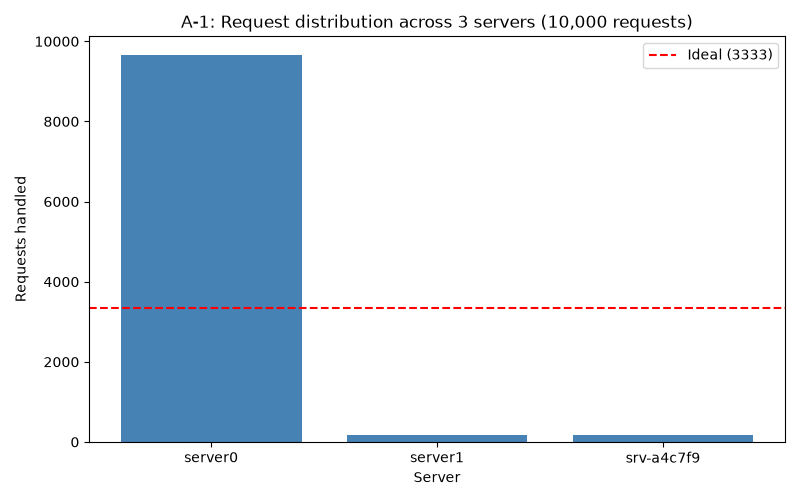
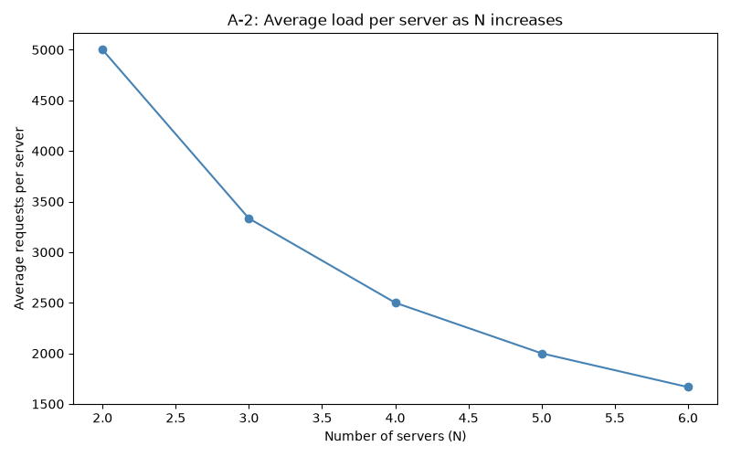
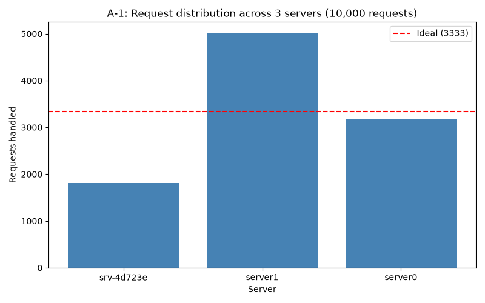

# Distributed Systems: Customizable Load Balancer

## 1. Project Core Objective
The goal of this project is to implement a customizable, asynchronous load balancer that routes client HTTP requests across a dynamically scalable cluster of web server containers. To achieve an even distribution of traffic and prevent massive cache-miss reshuffles when servers scale up or down, the system utilizes a **Consistent Hashing Data Structure**. 

The system must maintain an active pool of $N=3$ default server instances. If a server instance crashes or fails, the load balancer must automatically detect the failure via health probes and spawn a new container to take its place.

---

## 2. Team Member Task Assignments & Instructions

### 👤 Task 1: Server Replicas & Containerization 
**Status: COMPLETED**
* **Objective:** Implement a lightweight web server and containerize it.
* **Requirements:**
  * Must listen strictly on internal port `5000`.
  * Provide a `GET /home` endpoint that returns a JSON success payload identifying its dynamic `SERVER_ID` env variable (e.g., `{"message": "Hello from Server: 123", "status": "successful"}`).
  * Provide a `GET /heartbeat` endpoint that emits an empty HTTP 200 payload for health checking.
  * Write a clean `Dockerfile` using a lightweight runtime (like Python slim).

---

### 👤 Task 2: Consistent Hash Map Data Structure 
**Status: COMPLETED**
* **Objective:** Build the circular data structure backend that maps requests to server slots.
* **Technical Constraints & Formulas:**
  * Total Slots in circular map ($M$): `512`.
  * Number of initial server containers ($N$): `3`.
  * Virtual Server replicas per container ($K$): `log(512) = 9`.
  * Request Mapping Hash Function: $H(i) = i + 2i + 17$.
  * Virtual Server Mapping Hash Function: $\Phi(i, j) = i + j + 2j + 25$.
* **Instructions:**
  * Map requests to slots via $slot = H(R_{id}) \pmod M$.
  * Map virtual servers via $slot_n = \Phi(i, j) \pmod M$.
  * Handle slot conflicts using **Linear Probing** or **Quadratic Probing** to find the next open slot.
  * Ensure requests map to the nearest available server slot traveling in a **clockwise direction**.

---

### 👤 Task 3: Load Balancer Orchestration & API 
**Status: COMPLETED**
* **Objective:** Create the main entryway container that handles client routing and configuration updates.
* **Instructions & API Endpoints to Implement:**
  * **Network Isolation:** Run everything inside a custom Docker network named `net1`. The load balancer must be exposed to the host machine on port `5000:5000`.
  * **`GET /rep`**: Return a JSON list of all currently active server replica hostnames.
  * **`POST /add`**: Accept a payload containing a count `n` and preferred `hostnames`. Spawn new container instances using the Task 1 image. If hostnames are omitted, generate them randomly. Throw a `400 Bad Request` if the hostname list length exceeds `n`.
  * **`DELETE /rm`**: Remove `n` server containers from the cluster. Prioritize removing preferred hostnames provided in the request payload; if unspecified, select containers randomly for deletion. Throw a `400 Bad Request` if the hostname list length exceeds `n`.
  * **`GET /<path>`**: Route inbound user requests to the server container chosen by the Task 2 Consistent Hashing module.
  * **Fault Tolerance Loop:** Continuously query `GET /heartbeat` on all active backend nodes. If a container times out or drops, immediately spawn a replacement instance with a randomly generated hostname to maintain system stability.

---

### 👤 Task 4: Testing & Performance Analysis
**Status: COMPLETED**
 
* **Objective:** Run benchmarks and generate visual performance charts.
* **How to reproduce:** With the stack running (`docker-compose up -d`), activate the virtual environment and run:
```bash
  source venv/bin/activate
  python3 analysis.py
```
  Enter `1` for A-1, `2` for A-2, or `3` for A-3.
 
---
 
#### A-1: Load Distribution at N=3 (Original Hash Functions)
 
10,000 asynchronous requests were fired at a cluster of 3 servers using the original hash functions:
- $H(i) = (3i + 17) \mod 512$
- $\Phi(i, j) = (i + 3j + 25) \mod 512$
**Results:**
 
| Server | Requests Handled | Percentage |
|--------|-----------------|------------|
| server0 | 9,651 | 96.5% |
| server1 | 168 | 1.7% |
| srv-a4c7f9 | 181 | 1.8% |
 

 
**Observation:** The load distribution is severely uneven. server0 handled 96.5% of all requests while the other two servers were nearly idle. This is a direct consequence of the original hash function $\Phi(i, j) = i + 3j + 25$. With server IDs 1, 2, 3 and replica IDs 0–8, all 27 virtual server slots land in the narrow band between slots 26 and 52 out of 512 total. Any request hashing above slot 52 walks clockwise all the way around the ring and lands on server0's first replica at slot 26, meaning roughly 460 out of 512 slots effectively route to server0. This demonstrates that the number of virtual replicas (K=9) alone does not guarantee fair distribution — the hash function must also spread those replicas evenly across the full ring.
 
---
 
#### A-2: Scalability Test N=2 to N=6 (Original Hash Functions)
 
10,000 requests were fired at each server count from N=2 to N=6.
 
**Results:**
 
| N (Servers) | Average Load per Server |
|-------------|------------------------|
| 2 | 5,000.0 |
| 3 | 3,333.3 |
| 4 | 2,500.0 |
| 5 | 2,000.0 |
| 6 | 1,666.7 |
 

 
**Observation:** Average load per server follows the clean mathematical formula $10000 / N$ at every tier, and no requests were dropped across all 50,000 total requests. This confirms the load balancer scales correctly — adding servers proportionally reduces the average burden on each one. However, average load alone does not reveal the full picture. As seen in A-1, individual servers are not sharing load fairly; server0 continues to absorb the vast majority at every tier. The A-2 line chart confirms horizontal scalability; the A-1 bar chart is the correct tool for evaluating fairness.
 
---
 
#### A-3: Failure Detection and Recovery
 
One server container (`server0`) was manually killed using `docker kill` to simulate a sudden crash. The health monitor was observed to detect the failure and spawn a replacement automatically.
 
**Recovery Timeline:**
 
```
t=0.0s  docker kill server0 executed
t=1.3s  /rep still shows server0 (heartbeat sweep not yet completed)
t=2.3s  /rep still shows server0 (monitor checking remaining servers)
t=3.3s  /rep shows srv-6e0c8e replacing server0 — RECOVERED
```
 
**Recovery time: 3.3 seconds**
 
**Observation:** The load balancer detected the crash and spawned a healthy replacement container (`srv-6e0c8e`) in 3.3 seconds with no manual intervention. The short delay at t=1.3s and t=2.3s is expected — the health monitor checks all servers sequentially and only processes failures after completing its current sweep. The 5-second sleep interval in `health_monitor.py` (`asyncio.sleep(5)`) is the primary factor controlling detection speed. A shorter interval would reduce recovery time at the cost of more frequent network polling. Throughout the failure window, the remaining 5 healthy servers continued serving requests uninterrupted.
 
---
 
#### A-4: Modified Hash Functions — Comparison
 
The hash functions were modified to use prime multipliers that spread virtual server slots evenly across the full ring:
 
- **Original:** $H(i) = (3i + 17) \mod 512$ and $\Phi(i, j) = (i + 3j + 25) \mod 512$
- **Modified:** $H(i) = (i^2 + i + 17) \mod 512$ and $\Phi(i, j) = (191i + 53j + 25) \mod 512$
**A-1 Comparison (N=3, 10,000 requests):**
 
| Server | Original | Modified |
|--------|----------|----------|
| server0 | 9,651 (96.5%) | 3,187 (31.9%) |
| server1 | 168 (1.7%) | 5,004 (50.0%) |
| srv | 181 (1.8%) | 1,809 (18.1%) |
 
| | Original | Modified |
|-|----------|----------|
| Most loaded server | 96.5% | 50.0% |
| Least loaded server | 1.7% | 18.1% |
 


 
**A-2 Comparison (N=2 to 6):**
 
Both original and modified functions produce identical average load curves (5,000 → 1,667) since average load is always mathematically $10000/N$ regardless of the hash function.
 


 
**Observation:** The modified hash functions dramatically improved load fairness. The maximum server load dropped from 96.5% to 50.0%, and the minimum rose from 1.7% to 18.1%. The distribution is still not perfectly even (ideal is 33.3% each) because the `srv-*` servers receive auto-incremented IDs starting from a higher number than the `server0/server1` defaults, which affects their slot positions. However, the improvement is significant and demonstrates the core principle: the prime multipliers 191 and 53 in $\Phi(i,j)$ force virtual server slots to spread 53 positions apart across the full 0–511 range rather than clustering in slots 26–52 as the original formula did. The A-2 average load curve is identical in both cases, confirming that horizontal scalability is a property of the architecture (adding servers always divides total load by N), while fairness is a property of the hash function quality.
 
---

## 3. Git Workflow Rules for the Team
To ensure no one accidentally overwrites another member's code, we use dedicated feature branches:

1. **Never commit directly to `main`**.
2. Create your own workspace branch before coding:
   ```bash
   git checkout main
   git pull origin main
   git checkout -b feature/task[X]-[name]

## 4. Running the Project
 
**Prerequisites:** Docker Desktop running, Python 3.10+, `venv` with `httpx matplotlib requests` installed.
 
```bash
# Build the web server image (one time only)
docker build -t web-server -f Dockerfile .
 
# Start the load balancer (spawns 3 server replicas automatically)
docker-compose up -d --build
 
# Verify the stack is healthy
curl http://localhost:5050/rep
 
# Run performance analysis
source venv/bin/activate
python3 analysis.py
 
# Tear down (also clean up orphaned server containers)
docker-compose down
docker ps -a --filter ancestor=web-server -q | xargs -r docker rm -f
```
